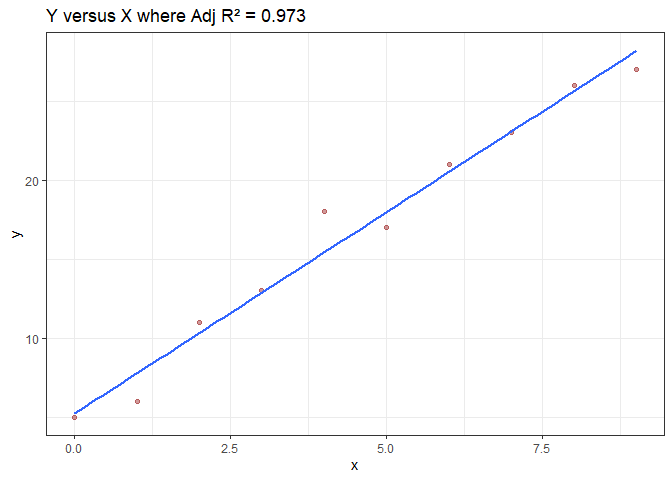
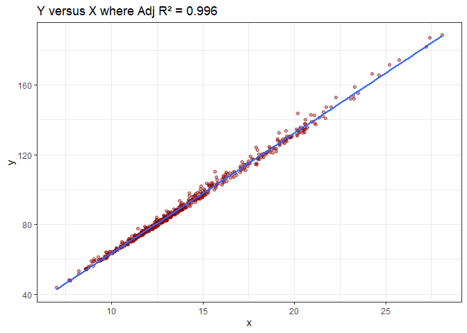

Assignment-B2
================
Alex Pieters
2024-11-08

# linearityCheck

The goal of the `linearityCheck` R Package is to display the linear
relationship between two variables and compute the R-squared and p-value
of the fit. The package includes the `linearity_check` function which
plots two variables against each other, overlays the linear fit, and
displays the regression R-squared value on the `ggplot`. The linear
regression model uses `lm()` with y ~ x.

**Function features:**

- Plots y versus x and overlays the linear fit.

- Calculates the adjusted R-squared and p-value of the linear regression
  model.

## Installation

You can install the `linearityCheck` package from GitHub with:

``` r
# Install "devtools" if you have never installed it before.
# install.packages("devtools")

# Install `linearityCheck` from GitHub
devtools::install_github("stat545ubc-2024/linearityCheck", ref = "0.1.0")
```

## Examples

### Example 1: Basic example with fictive data

This example plots y versus x and returns the R-squared and P-values of
the linear fit.

``` r
library(linearityCheck)

## Example using fictive x and y
x <- c(0:9)
y <- c(5,6,11,13,18,17,21,23,26,27)
linearity_check(x,y)
```

    ## $r_squared
    ## [1] 0.9734015
    ## 
    ## $p_value
    ##        value 
    ## 8.626282e-08 
    ## 
    ## $plot

    ## `geom_smooth()` using formula = 'y ~ x'

<!-- -->

### Example 2: Using the cancer_sample dataset

This example plots the mean perimeter versus radius from the
cancer_sample data in the datateachr library, saves and displays the
outputs.

``` r
library(linearityCheck)
library(datateachr) 

## Example using the cancer_sample data from the datateachr library
x = cancer_sample$radius_mean # stores the mean radius
y = cancer_sample$perimeter_mean # stores the mean perimeter

# Use the function
output <-linearity_check(x,y)

# View plot
output$plot
```

    ## `geom_smooth()` using formula = 'y ~ x'

<!-- -->

``` r
# View R-square
output$r_squared
```

    ## [1] 0.9957076

``` r
# View p-value
output$p_value
```

    ## value 
    ##     0
